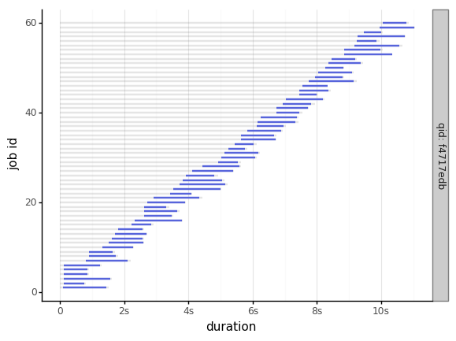
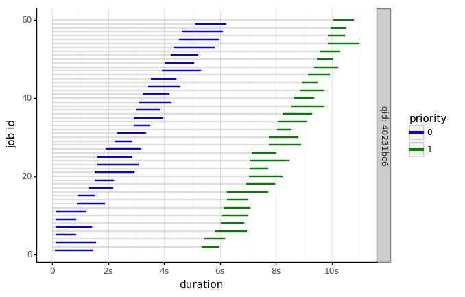
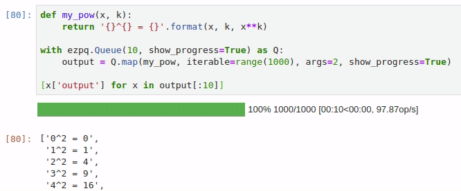
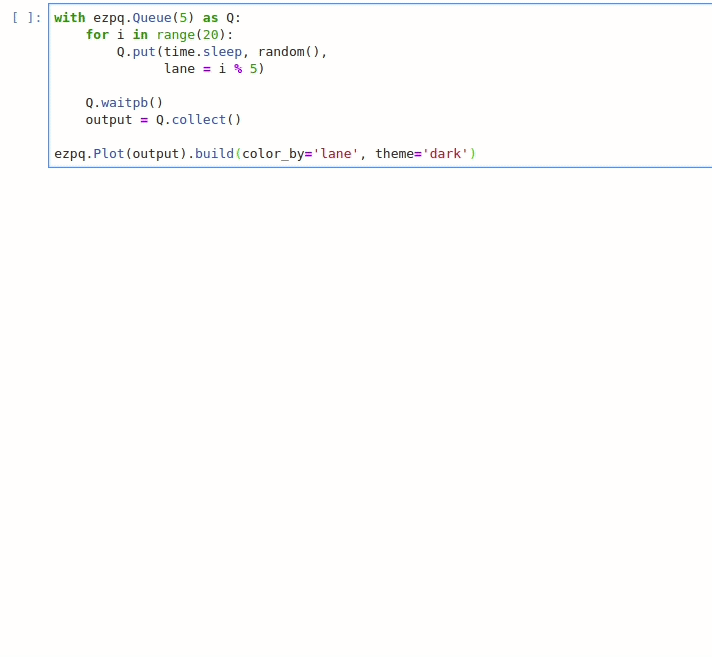
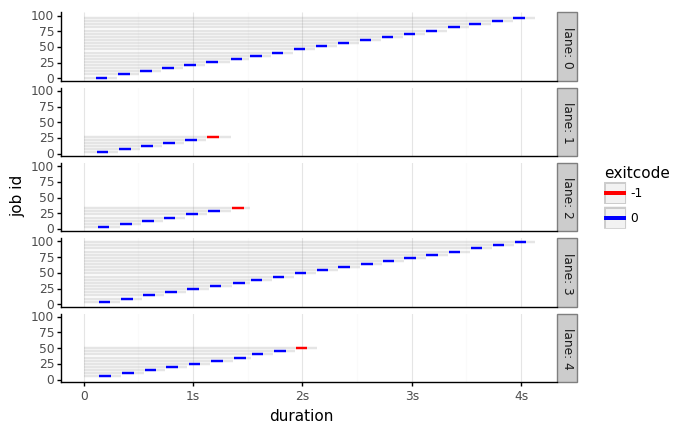
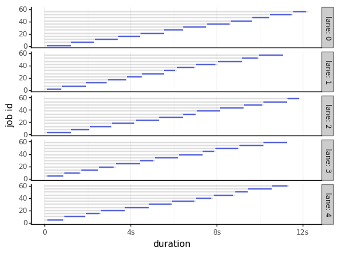

# `ezpq`: an easy parallel queueing system.

* [`ezpq`: an easy parallel queueing system.](#ezpq-an-easy-parallel-queueing-system)
  * [Overview](#overview)
  * [Features](#features)
  * [How to get it](#how-to-get-it)
  * [Quickstart](#quickstart)
  * [ezpq.Queue](#ezpqqueue)
  * [ezpq.Job](#ezpqjob)
    * [put](#put)
    * [size](#size)
    * [wait](#wait)
    * [get](#get)
    * [collect](#collect)
    * [map](#map)
    * [dispose](#dispose)
  * [Synchronous Lanes](#synchronous-lanes)
    * [Lane Error Handling](#lane-error-handling)
  * [ezpq.Plot](#ezpqplot)
  * [More Examples](#more-examples)

Read this on [GitHub](https://github.com/dm3ll3n/ezpq) or [my
site](https://www.donaldmellenbruch.com/project/ezpq/).

## Overview

`ezpq` implements a parallel queueing system consisting of:

1.  a priority “waiting” queue in.
2.  a lookup table of “working” jobs.
3.  a priority “completed” queue out.

The queueing system uses `multiprocessing.Process` by default and can
also run jobs with `threading.Thread`.


## Features

-   Simple interface; pure Python.
-   No required dependencies outside of standard library.
-   Optional integration with [`tqdm`](https://github.com/tqdm/tqdm)
    progress bars.
-   Compatible with Python 2 & 3.
-   Cross platform with MacOS, Linux, and Windows.
-   Data remains in-memory.
-   Priority Queueing, both in and out and within lanes.
-   Synchronous lanes allow dependent jobs to execute in the desired
    order.
-   Easily switch from processes to threads.
-   Automatic handling of output.
-   Rich job details, easily viewed as pandas dataframe.
-   Built-in logging to CSV.
-   Customizable visualizations of queue operations.

## How to get it

Install from [PyPI](https://pypi.org/project/ezpq/) with:

``` python
pip install ezpq
```

Optional packages:

``` python
pip install pandas    # required for plots
pip install plotnine  # required for plots
pip install tqdm      # required for progress bars
```

## Quickstart

Suppose you wanted to speed up the following code, which runs 60
operations that take anywhere from 0s to 2s. With an average job time of
~1s, this operation should take ~60s.

``` python
import time
import random
def random_sleep(x):
  random.seed(x)
  n = random.uniform(0.5, 1.5)
  time.sleep(n)
  return n
```

``` python
start = time.time()
output = [random_sleep(x) for x in range(60)]
end = time.time()
print('> Runtime: ' + str(end - start))
```

    ## '> Runtime: 58.932034969329834'

Here is the function ran in parallel with an `ezpq` Queue of 6 workers.
Thus, the runtime of the above operation will be reduced from ~60s to
~10s.

``` python
import time
import random
import ezpq
start = time.time()
with ezpq.Queue(6) as Q:
  output = Q.map(random_sleep, range(60))
end = time.time()
print('> Runtime: ' + str(end - start))
```

Here is the same scenario, using the `@ezpq.Queue` decorator.

``` python
@ezpq.Queue(6)
def random_sleep(x):
    random.seed(x)
    n = random.uniform(0.5, 1.5)
    time.sleep(n)
    return n
output = random_sleep(iterable=range(60))
```

While `map()` and the decorator are useful for quick-n-simple
parallization, the essential functions of an `ezpq` Queue include
`put()`, `wait()`, and `get()` (or `collect()`).

``` python
with ezpq.Queue(6) as Q:
    for x in range(60):
        Q.put(random_sleep, args=x)
    Q.wait()
    output = Q.collect()
```

The output is a list of dicts containing verbose information about each
job, along with its output, and exit code.

``` python
print( output[0] )
```

    ## {'args': [0],
    ##  'callback': None,
    ##  'cancelled': False,
    ##  'ended': datetime.datetime(2019, 2, 18, 20, 21, 0, 902915),
    ##  'exception': None,
    ##  'exitcode': 0,
    ##  'function': 'random_sleep',
    ##  'id': 1,
    ##  'kwargs': None,
    ##  'lane': None,
    ##  'name': 1,
    ##  'output': 1.3444218515250481,
    ##  'priority': 100,
    ##  'processed': datetime.datetime(2019, 2, 18, 20, 21, 0, 955396),
    ##  'qid': 'f4717edb',
    ##  'runtime': 1.3515939712524414,
    ##  'started': datetime.datetime(2019, 2, 18, 20, 20, 59, 551321),
    ##  'submitted': datetime.datetime(2019, 2, 18, 20, 20, 59, 446199),
    ##  'timeout': 0}

Easily convert output to a `pandas` dataframe:

``` python
import pandas as pd
df = pd.DataFrame(output)
print( df.head()[['id', 'output', 'runtime', 'exitcode']] )
```

    ##    id    output   runtime  exitcode
    ## 0   1  1.344422  1.351594         0
    ## 1   2  0.634364  0.640723         0
    ## 2   3  1.456034  1.461620         0
    ## 3   4  0.737965  0.743645         0
    ## 4   5  0.736048  0.742260         0

Use `ezpq.Plot` to generate a Gannt chart of the job timings.

``` python
plt = ezpq.Plot(output).build(show_legend=False)
plt.save('docs/imgs/quickstart.png')
```



## ezpq.Queue

The `Queue` class implements the queueing system, which is itself a
3-part system composed of the:

1.  waiting queue
2.  working table
3.  completed queue

<!-- -->

    ## Help on function __init__ in module ezpq.Queue:
    ## 
    ## __init__(self, n_workers=8, max_size=0, job_runner=<class 'multiprocessing.context.Process'>, auto_remove=False, auto_start=True, auto_stop=False, callback=None, log_file=None, poll=0.1, show_progress=False, qid=None)
    ##     Implements a parallel queueing system.
    ##     
    ##     Args:
    ##         n_workers: the max number of concurrent jobs.
    ##             - Accepts: int
    ##             - Default: cpu_count()
    ##         max_size: when > 0, will throw an exception the number of enqueued jobs exceeds this value. Otherwise, no limit.
    ##             - Accepts: int
    ##             - Default: 0 (unlimited)
    ##         job_runner: the class to use to invoke new jobs.
    ##             - Accepts: multiprocessing.Process, threading.Thread
    ##             - Default: multiprocessing.Process
    ##         auto_remove: controls whether jobs are discarded of after completion.
    ##             - Accepts: bool
    ##             - Default: False
    ##         auto_start: controls whether the queue system "pulse" is started upon instantiation (default), or manually.
    ##             - Accepts: bool
    ##             - Default: True
    ##         auto_stop: controls whether the queue system "pulse" stops itself after all jobs are complete.
    ##             - Accepts: bool
    ##             - Default: False
    ##         callback: optional function to execute synchronously immediately after a job completes.
    ##             - Accepts: function object
    ##             - Default: None
    ##         log_file: if file path is specified, job data is written to this path in CSV format.
    ##             - Accepts: str
    ##             - Default: None
    ##         poll: controls the pulse frequency; the amount of time slept between operations.
    ##             - Accepts: float
    ##             - Default: 0.1
    ##     
    ##     Returns:
    ##         ezpq.Queue object.
    ## 
    ## None

## ezpq.Job

A `ezpq` job defines the function to run. It is passed to an `ezpq`
queue with a call to `submit()`.

    ## Help on function __init__ in module ezpq.Job:
    ## 
    ## __init__(self, function, args=None, kwargs=None, name=None, priority=100, lane=None, timeout=0, suppress_errors=False, stop_on_lane_error=False)
    ##     Defines what to run within a `ezpq.Queue`, and how to run it.
    ##     
    ##     Args:
    ##         function: the function to run.
    ##             - Accepts: function object
    ##         args: optional positional arguments to pass to the function.
    ##             - Accepts: list, tuple
    ##             - Default: None
    ##         kwargs: optional keyword arguments to pass to the function.
    ##             - Accepts: dict
    ##             - Default: None
    ##         name: optional name to give to the job. Does not have to be unique.
    ##             - Accepts: str
    ##             - Default: None; assumes same name as job id.
    ##         priority: priority value to assign. Lower values get processed sooner.
    ##             - Accepts: int
    ##             - Default: 100
    ##         lane: a sequential lane to place the job in. if it does not already exist, it will be created.
    ##             - Accepts: int, str; any hashable object
    ##             - Default: None; no lanes.
    ##         timeout: When > 0, if this value (in seconds) is exceeded, the job is terminated. Otherwise, no limit enforced.
    ##             - Accepts: float
    ##             - Default: 0 (unlimited)
    ##     
    ##     Returns:
    ##         ezpq.Job object
    ## 
    ## None

``` python
with ezpq.Queue(6) as Q:
  for x in range(60):
    priority = x % 2 # give even numbers higher priority.
    job = ezpq.Job(random_sleep, args=x, priority=priority)
    Q.submit(job)
  Q.wait()
  output = Q.collect()
```



### put

The `put` method creates a job and submits it to an `ezpq` queue. All of
its arguments are passed to `ezpq.Job()`.

``` python
with ezpq.Queue(6) as Q:
    for x in range(60):
        Q.put(random_sleep, args=x)
    Q.wait()
    output = Q.collect()
```

### size

`size()` returns a count of all items across all three queue components.
It accepts three boolean parameters, `waiting`, `working`, and
`completed`. If all of these are `False` (default), all jobs are
counted. If any combination of these is `True`, only the corresponding
queue(s) will be counted. For example:

``` python
def print_sizes(Q):
    msg = 'Total: {0}; Waiting: {1}; Working: {2}; Completed: {3}'.format(
        Q.size(),
        Q.size(waiting=True),
        Q.size(working=True),
        Q.size(completed=True)
    )
    print(msg)
```

``` python
with ezpq.Queue(6) as Q:
    # enqueue jobs
    for x in range(60):
        Q.put(random_sleep, x)
    # repeatedly print sizes until complete.
    while Q.size(waiting=True, working=True):
        print_sizes(Q)
        time.sleep(1)
    print_sizes(Q)
```

    ## 'Total: 60; Waiting: 60; Working: 0; Completed: 0'
    ## 'Total: 60; Waiting: 51; Working: 6; Completed: 3'
    ## 'Total: 60; Waiting: 46; Working: 6; Completed: 8'
    ## 'Total: 60; Waiting: 39; Working: 6; Completed: 15'
    ## 'Total: 60; Waiting: 34; Working: 6; Completed: 20'
    ## 'Total: 60; Waiting: 31; Working: 6; Completed: 23'
    ## 'Total: 60; Waiting: 24; Working: 6; Completed: 30'
    ## 'Total: 60; Waiting: 17; Working: 6; Completed: 37'
    ## 'Total: 60; Waiting: 12; Working: 6; Completed: 42'
    ## 'Total: 60; Waiting: 6; Working: 6; Completed: 48'
    ## 'Total: 60; Waiting: 1; Working: 6; Completed: 53'
    ## 'Total: 60; Waiting: 0; Working: 1; Completed: 59'
    ## 'Total: 60; Waiting: 0; Working: 0; Completed: 60'

### wait

The `wait()` method will block execution until all jobs complete. It
also accepts a `timeout` parameter, given in seconds. The return value
is the count of jobs that did not complete. Thus, a return value greater
than 0 indicates the timeout was exceeded. The parameter `poll` can be
used to adjust how frequently (in seconds) the operation checks for
completed jobs.

New in v0.2.0, include `show_progress=True` to show a progress bar while
waiting. This is equivalent to a call to `waitpb()`.


### get

`get()` retrieves and deletes (“pop”) the highest priority job from the
completed queue, if one is available. If the completed queue is empty,
`get()` returns `None`. However, `get()` will wait for a completed job
if `wait`, `poll`, or `timeout` are specified. If the timeout is
exceeded, `None` is returned.

``` python
with ezpq.Queue(6) as Q:
    n_inputs = 60
    output = [None] * n_inputs
    # enqueue jobs
    for x in range(n_inputs):
        Q.put(random_sleep, args=x)
        
    # repeatedly `get()` until queue is empty.
    for i in range(n_inputs):
        output[i] = Q.get(wait=True)
```

### collect

`collect()` is similar to `get()`, but it will return a list of *all*
completed jobs and clear the completed queue. It does not support the
`poll` or `timeout` parameters, but you can call `wait()` before
`collect()` if desired.

``` python
with ezpq.Queue(6) as Q:
    # enqueue jobs
    for x in range(60):
        Q.put(random_sleep, x)
    # wait and collect all jobs
    print('Queue size before: {0}'.format(Q.size()))
    Q.wait()
    output = Q.collect()
    print('Queue size after: {0}'.format(Q.size()))
    print('Output size: {0}'.format(len(output)))
```

    ## 'Queue size before: 60'
    ## 'Queue size after: 0'
    ## 'Output size: 60'

### map

`map` encapsulates the logic of `put`, `wait`, and `collect` in one
call. Include `show_progress=True` to get output `tqdm` progress bar.



### dispose

The queueing operations performed by `ezpq.Queue` are performed on a
periodic basis. By default, the `poll` parameter for a Queue is `0.1`
seconds. This “pulse” thread will continue firing until the Queue is
disposed of.

In the previous examples, use of the context manager
(`with ezpq.Queue() as Q:`) results in automatic disposal. If not using
the context manager (or decorator), clean up after yourself with
`dispose()`.

## Synchronous Lanes

When you have jobs that are dependent upon another, you can use “lanes”
to execute them in sequence. All that is required is an arbitrary lane
name/id passed to the `lane` parameter of `put`. Empty lanes are
automatically removed.



In the above graphic, notice how same-colored bars never overlap. These
bars represent jobs that are in the same lane, which executed
synchronously.

### Lane Error Handling

You may want to short-circuit a synchronous lane if a job in the lane
fails. You can do this by specifying `skip_on_lane_error=True` when
putting a job in the queue. If specified and the preceding job has a
non-zero exit code, this job will not be run.

``` python
def reciprocal(x):
    time.sleep(0.1) # slow things down
    return 1/x      # will throw DivideByZero exception
```

``` python
import random
with ezpq.Queue(6) as Q:
    for i in range(100):
        Q.put(reciprocal, random.randint(0, 10), lane=i%5, suppress_errors=True, stop_on_lane_error=True)
    Q.wait()
    output = Q.collect()
plt = ezpq.Plot(output).build(facet_by='lane', color_by='exitcode', color_pal=['red', 'blue'])
plt.save('docs/imgs/lane_error.png')
```



## ezpq.Plot

The `Plot` class is used to visualize the wait, start, and end times for
each job that entered the queueing system. The class is initialized with
a list of dicts; exactly what is returned from a call to `collect()` or
`map()`.

Arguments given to `build()` control various aspects of the plot, from
coloring, to faceting,

    ## Help on function build in module ezpq.Plot:
    ## 
    ## build(self, color_by='qid', facet_by='qid', facet_scale='fixed', show_legend=True, bar_width=1, title=None, color_pal=None, theme='bw')
    ##     Produces a plot based on the data and options provided to a `ezpq.Plot()` object.
    ##     
    ##     Args:
    ##         color_by: controls the column to use for coloring the bars.
    ##             - Accepts: one of 'qid', 'priority', 'lane', 'cancelled', 'exitcode', 'name', 'output'
    ##             - Default: 'qid'
    ##         facet_by: controls the column to use for facetting the plot.
    ##             - Accepts: one of 'qid', 'priority', 'lane', 'cancelled', 'exitcode', 'name', 'output'
    ##             - Default: 'qid'
    ##         facet_scale: controls the scale of the x/y axis across facets.
    ##             - Accepts: one of 'fixed', 'free', 'free_x', 'free_y'
    ##             - Default: 'fixed'
    ##         show_legend: controls whether the legend is drawn.
    ##             - Accepts: bool
    ##             - Default: True
    ##         bar_width: controls the bar width
    ##             - Accepts: float
    ##             - Default: 1
    ##         title: optional title to be drawn above the plot.
    ##             - Accepts: str, None
    ##             - Default: None
    ##         theme:
    ##             - Accepts: 'bw', 'classic', 'gray', 'grey', 'seaborn', '538', 'dark', 'matplotlib', 'minimal', 'xkcd', 'light'
    ##             - Default: 'bw'
    ##     Returns:
    ##         The plot produced from plotnine.ggplot().
    ## 
    ## None

``` python
with ezpq.Queue(6) as Q:
  for x in range(60):
    lane = x % 5
    Q.put(random_sleep, x, timeout=1, lane=lane)
  Q.wait()
  output = Q.collect()
```

``` python
plt = ezpq.Plot(output).build(facet_by='lane', show_legend=False)
plt.save('docs/imgs/lanes2.png')
```



Each horizontal bar represents an independent job id. The start of the
gray bar indicates when the job entered the queuing system. The start of
the colored bar indicates when the job started running, and when it
ended. The gray bar that follows (if any) reflects how long it took for
the queue operations to recognize the finished job, join the job data
with its output, remove it from the working table, and place it in the
completed queue.

## More Examples

Many more examples can be found in
[docs/examples.ipynb](//github.com/dm3ll3n/ezpq/blob/master/docs/examples.ipynb).
