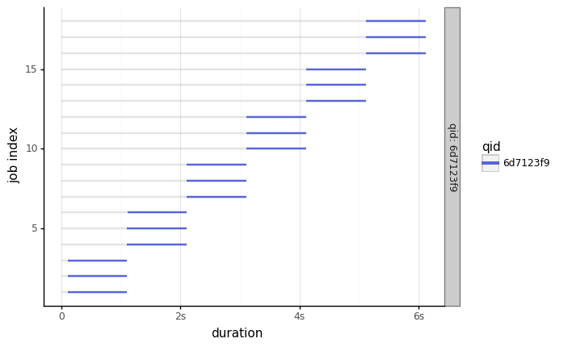
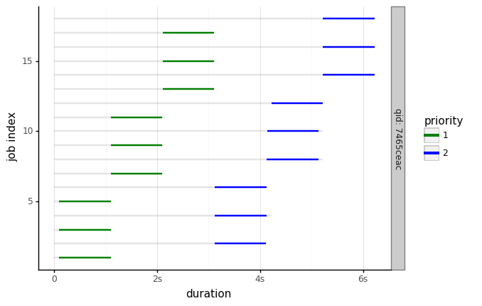

# ezpq

> None

| Links         |                        |
|---------------|------------------------|
| Code Repo     | https://www.github.com/fresh2dev/ezpq           |
| Mirror Repo   | https://www.Fresh2.dev/code/r/ezpq        |
| Documentation | https://www.Fresh2.dev/code/r/ezpq/i           |
| Changelog     | https://www.Fresh2.dev/code/r/ezpq/i/changelog |
| License       | https://www.Fresh2.dev/code/r/ezpq/i/license   |
| Funding       | https://www.Fresh2.dev/funding        |

[](https://www.github.com/fresh2dev/ezpq/releases)
[](https://www.github.com/fresh2dev/ezpq/releases)
[](https://www.Fresh2.dev/code/r/ezpq/i/license)
[](https://www.github.com/fresh2dev/ezpq/issues)
[](https://www.github.com/fresh2dev/ezpq/pulls)
[](https://star-history.com/#fresh2dev/ezpq&Date)
[](https://pypi.org/project/ezpq)
[](https://hub.docker.com/r/fresh2dev/ezpq)
[](https://www.Fresh2.dev/code/r/ezpq/i)
[](https://www.Fresh2.dev/code/r/ezpq/i/tests/coverage)
[](https://www.Fresh2.dev/funding)

*Brought to you by...*

<a href="https://www.fresh2.dev"></img></a>

---

> easy parallel queue

## Overview

`ezpq` is a Python module that serves as an abstraction layer to both `multiprocessing.Process` and `threading.Thread` that offers:
- a unified API for parallel processing using multiprocessing or threading.
- FIFO priority queueing.
- methods for generating plots.
- `tqdm` integration for progress-bars.
- error-handling, logging.
- cross-platform compatibility.

This project is:
- free, open-source
- **fun**ctional
- interesting
- all I need it to be

This project is **not**:
- production-ready
- super-clean
- thoroughly documented

Bug reports and MRs are welcome, though I don't imagine any major enhancements; just enough to keep tests passing.

## Install

From PyPi: `pip install ezpq[plot]`

From source: `git clone ... && pip install .`

Run tests from source: `make test`

Build this README with Jupyter: `make builddocs`

## Examples

> imports.


```python
import ezpq
import threading
import multiprocessing as mp
import time
```

> minimal example.

3 workers, 18 jobs, each job takes 1 second:


```python
with ezpq.Queue(
    workers=3,
    engine=threading.Thread,  # or `mp.Process`
    show_progress=True
) as queue:

    # put, wait, collect.
    finished = queue.map(time.sleep, [1] * 18, show_progress=True)

# plot.
ezpq.Plot(finished).build()
```


      0%|          | 0/18 [00:00<?, ?op/s]


    <ggplot: (8780880510672)>


> minimal example with decorator.

Same as above, but using the @decorator interface.


```python
# define.
@ezpq.Queue(
    workers=3,
    engine=threading.Thread,  # or `mp.Process`
    show_progress=True
)
def time_sleep(x):
    time.sleep(x)

# call and collect.
finished = time_sleep([1] * 18)

# plot.
ezpq.Plot(finished).build()
```


      0%|          | 0/18 [00:00<?, ?op/s]





    <ggplot: (8780880329972)>


> verbose form.

`map` is an abstraction to:
1. `put`
2. `wait`
3. `collect` (or `get`)

In addition to using the verbose form, the example below also flips the priority for every-other-job.


```python
with ezpq.Queue(
    workers=3,
    engine=threading.Thread,  # or `mp.Process`
    show_progress=True
) as queue:

    # put.
    for i in range(18):
        queue.put(time.sleep, 1, priority=(i%2)+1)

    # wait.
    queue.wait()

    # collect.
    finished = queue.collect()

# plot.
ezpq.Plot(finished).build(color_by='priority', color_pal=['green', 'blue'])
```


      0%|          | 0/18 [00:00<?, ?op/s]





    <ggplot: (8780867657466)>
